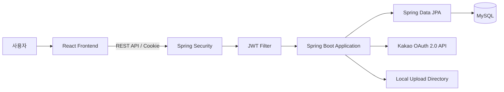
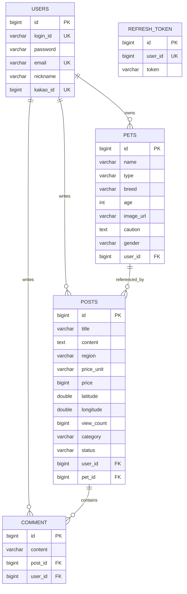

# 🐶 Petmily Backend

> 반려동물 보호자와 펫시터를 연결하는 돌봄 구인·구직 서비스의 백엔드 프로젝트


## 📌 프로젝트 소개

Petmily는 반려동물 보호자가 돌봄을 요청하고, 펫시터가 구인·구직 게시글을 통해 돌봄 정보를 확인할 수 있는 웹 서비스입니다.

Spring Boot 기반 REST API로 회원·반려동물·게시글·댓글 기능을 구현했습니다. Spring Security와 JWT를 이용해 인증을 처리하고, Access Token과 Refresh Token은 HttpOnly Cookie로 전달합니다. 또한 Kakao OAuth 2.0 로그인과 CSRF Token 검증을 적용했습니다.

- 개발 형태: 개인 프로젝트
- 개발 기간: 2025.09 ~ 진행 중
- Frontend Repository: [Petmily_FE](https://github.com/woohyun1007/Petmily_FE)

## 🛠 기술 스택

| 구분 | 기술 |
|---|---|
| Language | Java 17 |
| Backend | Spring Boot, Spring MVC, Spring Security |
| Data | Spring Data JPA, Hibernate, MySQL |
| Authentication | JWT, Kakao OAuth 2.0, CSRF Token |
| Build | Gradle |
| Collaboration | Git, GitHub |

## 🏗 시스템 아키텍처



## 📂 프로젝트 구조

```text
src/main/java/kwh/Petmily_BE
├── domain
│   ├── auth       # 로그인, 토큰 발급·재발급, 로그아웃, 카카오 로그인
│   ├── user       # 회원가입, 회원정보·비밀번호 관리, 회원 탈퇴
│   ├── pet        # 반려동물 등록·조회·수정·삭제
│   └── post       # 게시글, 검색·필터링·페이징, 댓글 관리
└── global
    ├── error      # 공통 예외 처리
    ├── file       # 이미지 파일 저장
    └── security   # Security 설정, JWT 필터, 사용자 인증 정보
```

## 🗄 ERD



## ✨ 주요 기능

| 도메인 | 구현 기능 |
|---|---|
| 인증 | 일반 로그인, JWT 발급·재발급, 로그아웃, 현재 로그인 사용자 조회 |
| 소셜 로그인 | Kakao Authorization Code를 이용한 로그인 및 계정 연동 |
| 보안 | BCrypt 비밀번호 암호화, HttpOnly Cookie, CSRF Token, CORS 및 보안 헤더 설정 |
| 회원 | 회원가입, 내 정보 조회·수정, 비밀번호 변경, 회원 탈퇴 |
| 반려동물 | 이미지가 포함된 반려동물 등록, 내 반려동물 목록·상세 조회, 수정·삭제 |
| 게시글 | 게시글 작성·상세 조회·수정·삭제, 조건 검색, 상태·카테고리 필터, 페이징 |
| 댓글 | 게시글별 댓글 작성·조회, 작성자 검증 기반 수정·삭제 |
| 공통 처리 | Bean Validation, 공통 예외 응답, 생성·수정 시간 관리 |

## 🚀 실행 방법

### 1. 요구사항

- Java 17
- MySQL 8.x

### 2. 저장소 복제

```bash
git clone https://github.com/woohyun1007/Petmily_BE.git
cd Petmily_BE
```

### 3. 환경 변수 설정

프로젝트 루트에 `.env` 파일을 만들고 다음 값을 설정합니다.

```dotenv
DB_URL=jdbc:mysql://localhost:3306/petmily
DB_USERNAME=your_username
DB_PASSWORD=your_password

JWT_SECRET=your_jwt_secret
JWT_EXPIRATION=3600000
JWT_REFRESH_EXPIRATION=86400000

FRONTEND_URL=http://localhost:5173
KAKAO_CLIENT_ID=your_kakao_client_id
KAKAO_CLIENT_SECRET=your_kakao_client_secret
KAKAO_REDIRECT_URI=http://localhost:8080/api/auth/kakao/callback
```

> Kakao 관련 환경 변수명은 현재 `KakaoAuthService`에서 참조하는 설정값에 맞춰 조정해야 합니다.

### 4. 애플리케이션 실행

```bash
./gradlew bootRun
```

Windows에서는 다음 명령을 사용합니다.

```powershell
.\gradlew.bat bootRun
```

## 📌 Future Improvements

- Docker 기반 컨테이너 배포
- Redis 기반 Refresh Token 관리
- WebSocket 기반 실시간 채팅
- CI/CD 자동 배포 구축
  
- Notion : [Petmily 상세 문서](https://app.notion.com/p/Petmily-39fb883853bf806eae1de6f2e3e11cf6?source=copy_link)
